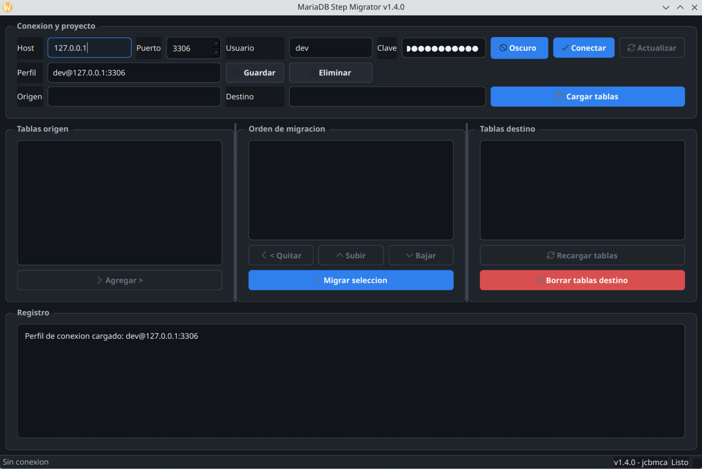

# MariaDB Step Migrator

Version: **1.4.0**

Autor: **jcbmca**

Aplicacion de escritorio en Python + Qt6 para migrar tablas MariaDB entre bases visibles para una misma cuenta. Esta pensada para migraciones paso a paso: elegis una base origen, una base destino, armas un orden de tablas y ejecutas copias controladas.



## Funcionalidades

- Conexion a MariaDB por host, puerto, usuario y clave.
- Precarga opcional de credenciales desde `.env`.
- Listado de bases disponibles para la cuenta conectada.
- Seleccion explicita de proyecto: DB origen -> DB destino.
- Boton **Cargar tablas** para cargar o cambiar el proyecto.
- Confirmacion antes de cambiar un proyecto ya cargado.
- Seleccion multiple de tablas de origen.
- Orden manual de migracion con **Subir** y **Bajar**.
- Migracion con `CREATE OR REPLACE TABLE ... AS SELECT`.
- Listado de tablas en destino.
- Borrado manual de una o varias tablas destino.
- Indicador de carga con contador de tareas y segundos transcurridos.
- Registro de operaciones en pantalla.
- Tema claro u oscuro con boton de estado.
- Iconos en las acciones principales.
- Numero de version visible en el titulo y barra de estado.
- Distribucion compacta de conexion/proyecto para dar mas espacio a las tablas.
- Perfiles persistentes de conexion MariaDB con host, puerto, usuario y clave.

## Instalacion

```bash
python3 -m venv venv
venv/bin/pip install -r requirements.txt
```

## Ejecucion

```bash
venv/bin/python app.py
```

## Generar binario Linux

Instala dependencias de desarrollo:

```bash
venv/bin/pip install -r requirements-dev.txt
```

Genera el paquete:

```bash
./build.sh
```

El ejecutable queda en:

```bash
dist/mariadb-step-migrator/mariadb-step-migrator
```

El build usa PyInstaller en modo `--onedir`, recomendado para apps Qt porque deja las librerias y plugins junto al ejecutable.

## Configuracion `.env`

La app puede precargar datos desde `.env` si existen estas variables:

```env
MARIADB_SERVER=127.0.0.1
MARIADB_PORT=3306
MARIADB_USER=usuario
MARIADB_PASS=clave
MARIADB_NAME=base_origen_preferida
APP_THEME=Claro
```

`APP_THEME` acepta `Claro` u `Oscuro`.

## Perfiles de conexion

La app permite guardar multiples conexiones MariaDB desde el boton **Guardar** del panel superior. Cada perfil conserva:

- Host
- Puerto
- Usuario
- Clave

Los perfiles se cargan desde el selector **Perfil**. Tambien se puede eliminar el perfil seleccionado con **Eliminar**.

El archivo local de perfiles se guarda en:

```text
~/.config/mariadb-step-migrator/connections.json
```

Si existe `$XDG_CONFIG_HOME`, se usa:

```text
$XDG_CONFIG_HOME/mariadb-step-migrator/connections.json
```

La clave queda guardada en ese archivo local para poder reconectar en futuras aperturas de la app.

## Uso

1. Ingresa host, puerto, usuario y clave.
2. Usa el boton **Tema** para alternar entre claro y oscuro si queres cambiar la apariencia.
3. Opcionalmente guarda o carga una conexion desde **Perfil**.
4. Presiona **Conectar**.
5. Selecciona la **DB origen** y la **DB destino**.
6. Presiona **Cargar tablas**.
7. Si ya habia un proyecto cargado y cambias origen/destino, confirma si queres cambiar de proyecto.
8. Selecciona una o mas tablas de origen.
9. Presiona **Agregar >** para sumarlas al orden de migracion.
10. Ajusta el orden con **Subir** y **Bajar**.
11. Presiona **Migrar seleccion**.
12. En destino podes seleccionar una o varias tablas y presionar **Borrar tablas destino**.

## SQL ejecutado

Para cada tabla seleccionada, la app ejecuta:

```sql
CREATE OR REPLACE TABLE db_destino.nombre_tabla
AS SELECT * FROM db_origen.tabla_original;
```

Para borrar tablas en destino, ejecuta:

```sql
DROP TABLE IF EXISTS db_destino.nombre_tabla;
```

## Permisos necesarios

La cuenta MariaDB debe tener permisos suficientes para:

- Ver las bases y tablas que se quieran usar.
- Leer tablas en la base origen.
- Crear o reemplazar tablas en la base destino.
- Borrar tablas en destino si se usa la funcion de borrado.

La cuenta conectada solo vera las bases y tablas para las que tenga permisos.

## Notas operativas

- Cambiar de proyecto limpia la lista de migracion actual.
- Recargar el mismo proyecto actualiza las listas de tablas sin borrar el orden armado.
- Las consultas de metadata tienen timeout para evitar esperas indefinidas.
- Las migraciones pueden tardar segun el tamano de las tablas y la carga del servidor.

## Changelog

Ver [CHANGELOG.md](CHANGELOG.md).
